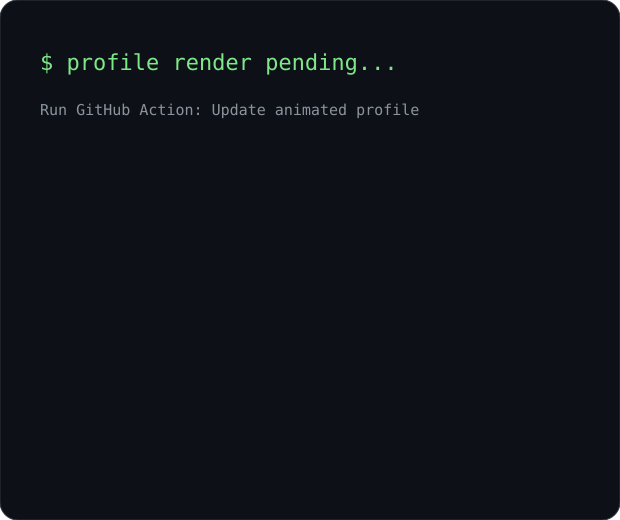

<h3>GitHub Activity</h3>

 
 

<h3>Profile &amp; Stats</h3>

<table>
<tr>
<td valign="top"></td>
<td valign="top"></td>
</tr>
</table>

 

<b>AI Engineer | AI Agents, RAG &amp; Ontology</b>

  
  

 

<h3>Tech Stack</h3>

<b>AI &amp; Agents</b>

  
  

<b>Search &amp; Retrieval</b>

  
  
  

<b>Evaluation &amp; Observability</b>

  

<b>Backend &amp; Data</b>

  
  
  
  
  

<b>Tools &amp; Infra</b>

  
  
  

<b>AI Coding Tools</b>

  
  

 

<h3 align="center">Featured Projects</h3>

| 프로젝트 | 소개 | 링크 |
| --- | --- | --- |
| **Archione** | 건폐율·용적률 등 건축 인허가 요건을 검토하고, 근거 조문과 계산 결과를 보여주는 서비스 | [상세 보기](https://flashy-newsstand-adf.notion.site/3bcad467c4ac80b09313f53ccff7f471) |
| **Buyer Agent** | 가격·사이즈 등 원하는 조건에 맞는 축구화를 찾아 비교해주는 AI 에이전트 | [상세 보기](https://flashy-newsstand-adf.notion.site/3c5ad467c4ac8052a015cecb416f0891) |
| **JarvisJust** | RAG 기반 대화형 매칭 서비스 | [상세 보기](https://flashy-newsstand-adf.notion.site/32fad467c4ac816e9d37e30a758457cc) |
| **BBQ Menu & CS** | BBQ 메뉴 추천과 고객 문의 응대를 위한 AI 챗봇 | [상세 보기](https://flashy-newsstand-adf.notion.site/3bcad467c4ac80a28d0ac493d050ab21) |
| **청년수당** | 청년수당 신청 조건과 사용 방법을 안내책자에서 찾아 답하는 AI 챗봇 | [상세 보기](https://flashy-newsstand-adf.notion.site/3bcad467c4ac80e989d0db4e2b9a9fa4) |
