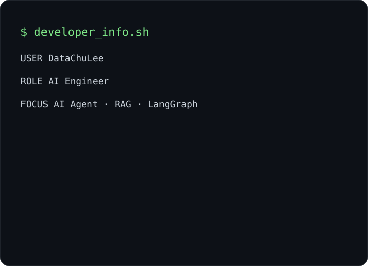

<div align="center">

# `DataChuLee@github:~$`

### AI Engineer · AI Agent · RAG · LangGraph


<br/>

<table>
<tr>
<td width="46%" align="center" valign="top">
  
</td>
<td width="54%" align="center" valign="top">
  
</td>
</tr>
</table>

</div>

---

## `$ cat focus.txt`

- **AI Agent / Multi-Agent** — LangGraph orchestration, tool routing, supervisor patterns
- **RAG / Retrieval** — FAISS, BM25, metadata filtering, hybrid retrieval
- **Backend** — Python, FastAPI, Redis, SSE
- **Evaluation** — Hit@K, MRR, constraint accuracy, latency analysis, regression tests

## `$ cat highlights.log`

```text
Buyer Agent        → 96.83% constraint accuracy / 3.38× faster response
JarvisJust         → 12.59s → 10.85s average latency (-13.8%)
RAG Systems        → retrieval + evidence grading + auditable decision flows
```

## `$ ls tech-stack/`

<p align="center">
  
</p>

<p align="center">
  
  
  
  
</p>

## `$ whoami`

```text
Building AI systems that are not only capable,
but measurable, traceable, and reliable.
```

<p align="center">
  <a href="mailto:qasd132@khu.ac.kr">
    
  </a>
</p>

---

<p align="center">
  <sub>Profile art is regenerated automatically by GitHub Actions.</sub>
</p>
