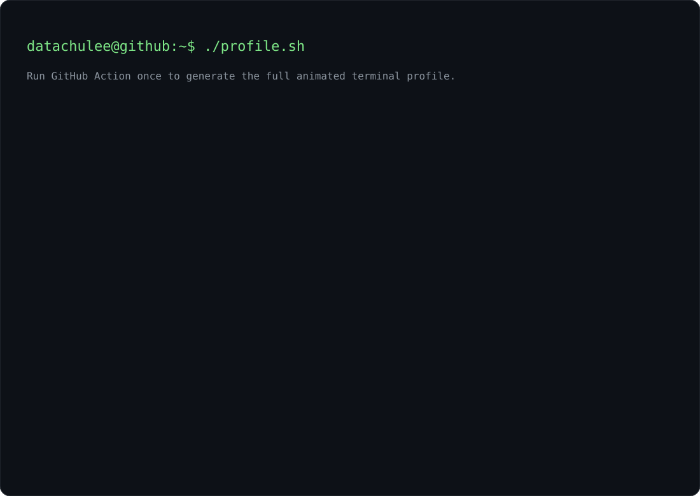

<div align="center">



</div>

---

## `$ cat highlights.log`

```text
Buyer Agent   → 96.83% constraint accuracy / 3.38× faster response
JarvisJust    → 12.59s → 10.85s average latency (-13.8%)
```

## `$ ls stack/`

<p align="center">
  
</p>

<p align="center">
  
  
  
  
</p>

<p align="center">
  <a href="mailto:qasd132@khu.ac.kr">
    
  </a>
</p>
